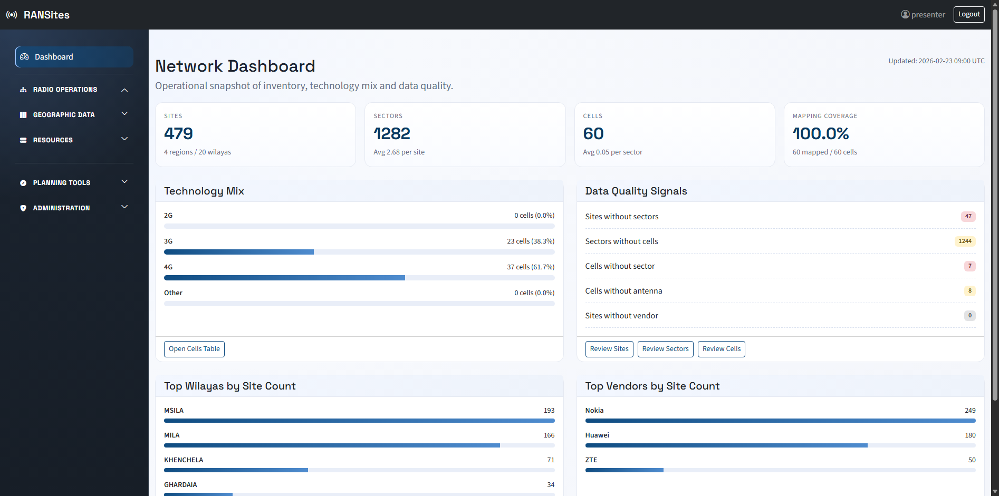
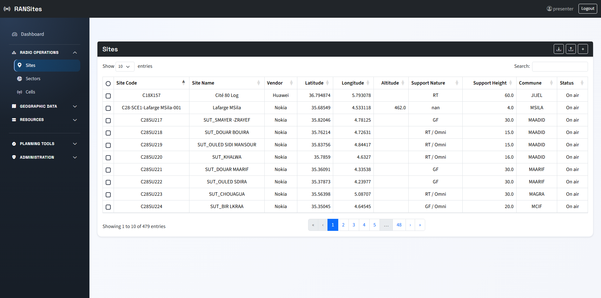
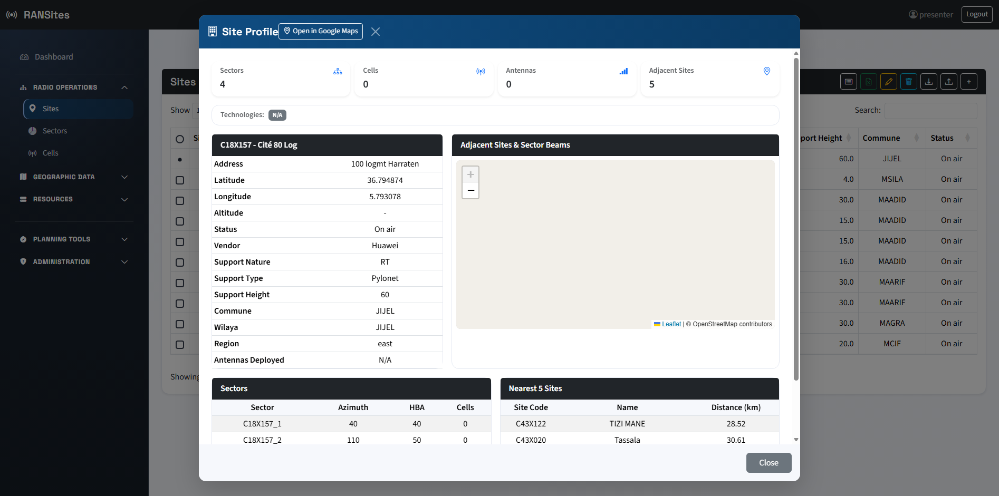
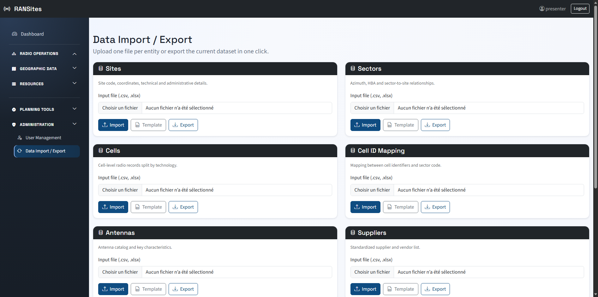

# RANSites

RANSites is a Flask-based platform for **RAN data governance and planning operations**.  
It consolidates Sites, Sectors, Cells, and Mapping into one controlled workspace, with import validation, operational exports, and scoped user access.

## Why RANSites

RAN teams usually face:

- fragmented Excel files
- inconsistent mapping rules
- repetitive manual exports
- limited traceability and role isolation

RANSites solves this by providing a single operational backbone for radio data and planning outputs.

## Core Capabilities

- Unified inventory: `Sites`, `Sectors`, `Cells`, `Mapping`, `Antennas`, `Suppliers`, geo references
- Role-based auth with access scope by `Wilaya`, `Commune`, and `Site`
- Dynamic Add/Edit forms with business validation rules
- Import/Export workspace with downloadable templates
- Allplan export generation
- KML export (sites + sector beams)
- Site Profile modal with:
  - technical metadata
  - KPI mini-cards
  - technology badges
  - nearest 5 sites with distance
  - interactive map + adjacent links + sector beams
- Dashboard with quality and coverage indicators

## Screenshots

### Dashboard



### Sites Table



### Site Profile (KPI + Map + Sector Beams)



### Import / Export Workspace



## Tech Stack

- Backend: Flask, SQLAlchemy, Flask-Migrate, Flask-Login
- Frontend: Jinja2, Bootstrap 5, DataTables, Leaflet
- Data layer: SQLite (default), migration-ready via Alembic
- Automation: Python scripts (`scripts/`) for screenshots and executive presentations

## Architecture

```text
app/
  models.py
  security.py
  routes/
    auth.py
    main.py
    list_data.py
    import_data.py
    add_data.py
    edit_data.py
    delete_data.py
    helpers.py
  templates/
  static/
migrations/
scripts/
run.py
```

## Quick Start

### 1) Create environment

```bash
python -m venv venv
venv\Scripts\activate
```

### 2) Install dependencies

```bash
pip install flask flask-sqlalchemy flask-migrate flask-login python-dotenv pandas openpyxl
```

Optional tools (presentation and automated screenshots):

```bash
pip install python-pptx matplotlib pillow selenium
```

### 3) Configure `.env`

```env
FLASK_APP=run.py
SECRET_KEY=change-me
DATABASE_URL=sqlite:///radio.db
FLASK_DEBUG=1
```

### 4) Apply migrations

```bash
flask db upgrade
```

### 5) Create first admin

```bash
flask create-user --username admin --admin
```

### 6) Run

```bash
python run.py
```

Open: `http://127.0.0.1:5000`

## Main Functional Routes

- Dashboard: `/dashboard`
- Data tables: `/sites`, `/sectors`, `/cells`, `/regions`, `/wilayas`, `/communes`, `/antennas`, `/vendors`
- Import/Export: `/import_export`
- Allplan export page: `/allplan_export`
- KML export page: `/kml_export`
- Site profile API: `/site-profile/<site_id>`

## Data Operations Notes

- Import templates are generated per entity from the UI.
- `cells` import supports multi-sheet Excel (`2G`, `3G`, `4G`, `5G`).
- Validation misses are exported to `validation_*.xlsx`.
- Mapping resolution uses cell suffix + technology + frequency/band logic.

## Security Notes

- CSRF protection is enabled for state-changing endpoints.
- Login is mandatory for protected routes.
- Non-admin users are restricted to assigned geographic/site scope.

## Roadmap

### Current Version (V1)

- RAN data governance + planning operations
- quality checks + standardized exports

### Next Version (V2)

Full lifecycle orchestration from **D1 to On Air**, with cross-department workflow:

- RAN
- Acquisition
- Construction

Target outcomes:

- end-to-end milestone tracking
- stronger cross-team coordination
- faster and more predictable go-live

## License

Internal enterprise project (update according to your organization policy).
